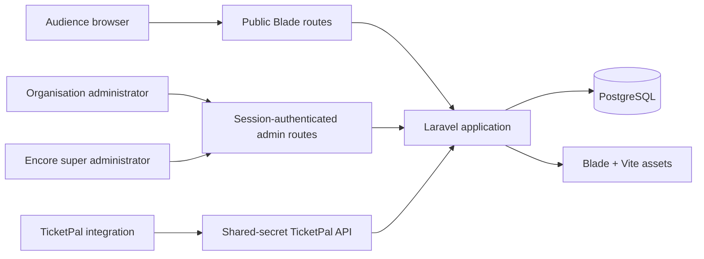

# System Architecture

## Architecture summary

Encore Reviews is a server-rendered Laravel 12 monolith. It exposes public Blade pages, authenticated administration pages, and JSON endpoints from one application and one relational database.

Redis, Mailpit, Meilisearch, and pgAdmin are provisioned by Docker Compose. The current application code does not implement a Redis-specific workflow, outbound invitation mail workflow, or Meilisearch-backed search.

## Technology baseline

| Concern | Current implementation |
| --- | --- |
| Application | Laravel 12, PHP `^8.2` |
| Container runtime | Laravel Sail; application image currently uses Sail PHP 8.5 |
| Database | PostgreSQL 18 Alpine in Compose |
| Domain identifiers | UUID primary keys; Laravel `HasUuids` |
| Administrative authentication | Laravel web guard and session cookies |
| Public frontend | Blade templates and custom CSS built by Vite |
| JavaScript build | Vite 7 |
| Tests | PHPUnit 11 through Laravel's test runner |
| Formatting | Laravel Pint |

## Request surfaces

### Public web

Public routes render the homepage, about page, show directory, show detail pages, and review submission form. Public show queries exclude archived shows. Public review output and scores include only approved reviews.

### Customer administration

Authenticated, active users enter `/admin`. Customer administrators receive an organisation-scoped dashboard. They can approve or reject reviews belonging to performances of their organisation's shows.

Tenant boundaries are applied through explicit query scoping and ownership checks in controllers; there is no global Eloquent tenant scope and no policy layer at present.

### Encore administration

Users with role `super_admin` are redirected from `/admin` to the organisation directory. They can create and update organisations, create and update organisation users, activate or deactivate organisations and users, assign unowned shows, and remove show assignments.

The support view renders organisation-scoped dashboard data in read-only mode. Super administrators are explicitly prevented from using the customer review moderation endpoint.

### JSON API

The API has two trust models:

- `/api/ticketpal/*` endpoints require the configured TicketPal shared secret.
- `/api/reviews` is public but requires a valid, unused, unexpired invitation token and, when the invitation has an email hash, the matching email address.

The exact contracts are in [the API reference](../03-API/README.md).

## Application layering

The current code uses these layers:

| Layer | Responsibility |
| --- | --- |
| Routes | URL registration and middleware composition |
| Middleware | TicketPal secret validation, active-admin enforcement, and super-admin enforcement |
| Form requests | Performance sync input validation |
| Controllers | HTTP validation for most endpoints, orchestration, response construction, and view selection |
| Services | Transactional performance synchronization business logic |
| Eloquent models | Relationships, fillable fields, casts, and UUID generation |
| Blade views | Public, authentication, customer administration, and super-administration presentation |

`PerformanceSyncService` is the only dedicated domain service currently present. Other workflows remain controller-led and should not be described as service-layer implementations.

## Primary data flows

### Provider show synchronization

1. TicketPal sends an authenticated show upsert.
2. Encore finds the show by `ticketpal + provider_event_id` under a database transaction.
3. Encore creates or updates the show and returns whether it was created.
4. `organisation_id` is optional, so imported shows can remain unassigned until an Encore administrator assigns them.

### Provider performance synchronization

1. TicketPal sends an authenticated performance upsert.
2. Encore locks and resolves the TicketPal show by provider event ID.
3. The show must belong to an organisation.
4. Encore resolves or creates a venue by organisation and normalized venue slug.
5. Encore creates or updates the performance by provider source and provider performance ID.
6. Provider timestamps are normalized to UTC before persistence.

### Invitation and review submission

1. TicketPal creates an invitation for an existing performance.
2. Encore stores hashes of the invitation token and normalized email; the raw token is returned in the creation response.
3. An audience member submits the token, email, score, recommendation choice, and optional review data.
4. Encore locks the unused invitation, validates expiry and email ownership, creates or reuses the reviewer, creates a pending verified review, and marks the invitation used in one transaction.
5. An organisation administrator moderates the review.
6. Approved reviews become visible publicly and contribute to aggregates.

## Transaction and concurrency behavior

- Review submission locks the invitation row so a token cannot be consumed twice concurrently.
- Show upsert locks an existing matching show during mutation.
- Performance synchronization locks the matching show and executes venue and performance resolution in one transaction.
- Database uniqueness enforces provider show identity, provider performance identity, and organisation-scoped venue slugs.

## Deployment shape

The repository provides one Compose network containing the Laravel application, PostgreSQL, Redis, Mailpit, Meilisearch, and pgAdmin. Persistent named volumes are defined for PostgreSQL, Redis, and Meilisearch. This is a development/runtime topology, not evidence of production high availability, replication, backups, autoscaling, or external observability.

See [Operations](../05-Operations/README.md) for commands and limitations.
