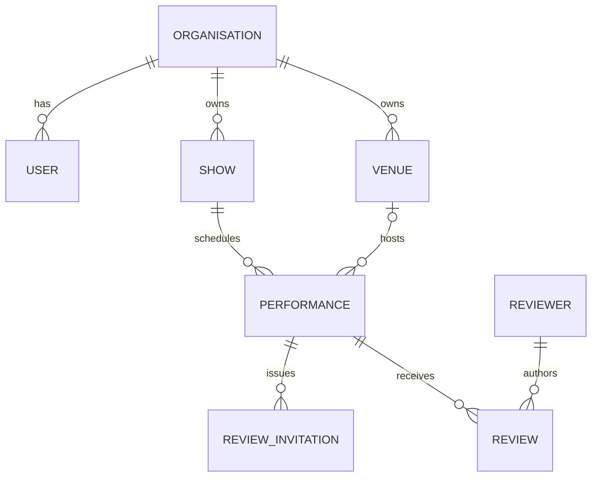

# Domain Model

## Aggregate overview



Organisation is the tenancy root. Review ownership is derived through `Review → Performance → Show → Organisation` rather than stored redundantly on the review.

`IntegrationEvent` and `AuditLog` are operational evidence records, not business aggregates and not children in the Organisation ownership hierarchy. Their nullable organisation references provide context without redefining domain ownership.

## Entity reference

### Organisation

Represents the live-event organisation that owns operational data.

Key fields:

- UUID `id`
- `name`
- optional `support_email`
- `is_active`
- optional internal `notes`

Relationships: users, shows, venues.

Deactivating an organisation prevents its customer users from logging in or accessing protected admin routes. It does not archive or delete its public shows.

### User

Represents an administrative identity authenticated by Laravel's web guard.

Key fields:

- numeric `id`
- nullable `organisation_id`
- unique `email`
- hashed `password`
- `role`
- `is_active`

Current roles are `customer_admin` and `super_admin`. Customer administrators belong to an organisation. Super administrators have no organisation.

### Show

Represents a production or event presented to the public.

Key fields include title, global public slug, descriptive content, genre, primary image path, status, ticket URL provenance, provider source, provider event ID, and nullable organisation ownership.

Allowed database statuses:

- `upcoming`
- `now_playing`
- `archived`

Provider identity is unique on `provider_source + provider_event_id`. The public homepage and directory exclude archived shows. Unassigned shows may exist after provider import and can be assigned by an Encore super administrator.

### Venue

Represents the location associated with performances.

Key fields include name, organisation-scoped slug, city, postcode, country, website, description, and hero image path. The provider performance sync currently supplies name, city, and postcode.

Venue identity for synchronization is unique on `organisation_id + slug`. A performance may have no venue at the database level, although TicketPal performance synchronization requires a venue name and resolves a venue.

### Performance

Represents a scheduled occurrence of a show.

Key fields include show, optional venue, start and end timestamps, free-form nullable status, provider source, provider event ID, provider performance ID, and provider update timestamp.

Provider performance identity is unique on `provider_source + provider_performance_id`. TicketPal synchronization normalizes timestamps to UTC. The current schema cascades performance deletion to its reviews and invitations.

### ReviewInvitation

Represents single-use proof that a reviewer may submit feedback for a performance.

Key fields include performance, email hash, token hash, sent/expiry/use timestamps, provider source, provider booking and ticket IDs, attendance state, and JSON metadata.

Lifecycle:

```text
created → usable → used
                 ↘ expired
```

`used_at` distinguishes consumed invitations. An invitation with no expiry does not expire, although the TicketPal endpoint defaults expiry to seven days.

### Reviewer

Represents a pseudonymized audience identity keyed by email hash.

Key fields are email hash, optional display name, and `trust_score`. The current workflow creates or reuses reviewers by email hash. It does not update an existing reviewer's display name during submission and does not currently calculate or use trust score.

### Review

Represents audience feedback for one performance.

Key fields include performance, reviewer, rating, recommendation choice, JSON tags, optional content, verification state/source, moderation state/reason, submission and edit timestamps, and optional network/client hashes.

Implemented submission rules:

- rating is an integer from 1 to 5;
- recommendation is required;
- content is limited to 2,000 characters;
- invitation submissions set `verified = true` and `verification_source = invitation`;
- new reviews set `moderation_status = pending`.

Moderation transitions supported by the customer administration endpoint:

```text
pending → approved
pending → rejected
approved ↔ rejected
```

The endpoint accepts approved or rejected regardless of current status, so re-moderation is possible. A moderation reason is optional.

## Operational evidence records

### IntegrationEvent

Records one authenticated provider delivery and its processing lifecycle. Provider plus external event ID is unique. The record retains a payload hash, correlation ID, attempts, sanitized failure classification, and an encrypted response for bounded duplicate replay. It does not retain the raw provider payload and is not a domain-event stream. See [ADR-014](../02-ADR/ADR-014-provider-event-store.md).

### AuditLog

Records an administrative actor, organisation context, business action, target entity, allowlisted before/after state, request metadata, correlation ID, and time. Mutation audit entries commit with their administrative command. The model is append-only at the application layer. An audit log is evidence about an aggregate; it is not owned mutable state of that aggregate.

## Public aggregation rules

For a show, the application loads approved reviews across all performances and calculates:

- review count;
- arithmetic mean rating;
- count and percentage of reviews where `would_recommend` is true.

Pending and rejected reviews do not contribute.

## Referential actions

| Relationship | Delete behavior |
| --- | --- |
| Organisation → users | Organisation deletion sets `organisation_id` to null |
| Organisation → shows | Organisation deletion sets `organisation_id` to null |
| Organisation → venues | Organisation deletion sets `organisation_id` to null |
| Show → performances | Cascade delete |
| Venue → performances | Set venue to null |
| Performance → invitations | Cascade delete |
| Performance → reviews | Cascade delete |
| Reviewer → reviews | Cascade delete |

The administration UI does not currently expose deletion of organisations, users, shows, venues, performances, reviewers, or reviews.

## Fields reserved but not operationalized

Some schema fields exist ahead of active workflows:

- reviewer `trust_score`;
- review `edited_until`;
- review `ip_hash` and `user_agent_hash`;
- venue country, website, description, and hero image;
- invitation attendance metadata and arbitrary JSON metadata.

Their presence must not be interpreted as implemented trust scoring, review editing, client fingerprinting, venue management, or attendance automation.
